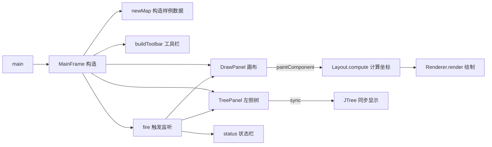

# 🚀 MindMap 项目从 `main` 开始逐行讲解

> 本文严格按照 **JVM 真实运行时控制流** 走完整个项目：从 `main` 第一行开始，跟着方法调用栈一步步往下追，**每一行代码负责什么** 都讲清楚。
>
> 配套阅读：[README.md](./README.md)

---

## 目录

- [一、整体架构总览](#一整体架构总览)
- [二、入口：MindMapApp.java](#二入口mindmapappjava)
- [三、主窗体构造：MainFrame.java](#三主窗体构造mainframejava)
  - [3.1 字段初始化](#31-字段初始化构造前最先执行)
  - [3.2 DrawPanel 构造](#32-drawpanel-构造最先执行的内部类)
  - [3.3 TreePanel 构造](#33-treepanel-构造)
  - [3.4 MainFrame 构造体](#34-回到-mainframe-构造体)
  - [3.5 newMap 构造样例数据](#35-newmap构造样例数据)
  - [3.6 buildToolbar 构造工具栏](#36-buildtoolbar构造顶部工具栏)
- [四、首屏渲染流程](#四首屏渲染流程窗体-setvisible-后由-swing-自动触发)
  - [4.1 Layout.compute 布局算法](#41-布局layoutcompute)
  - [4.2 Renderer.render 绘制](#42-渲染rendererrender)
- [五、运行后的事件循环](#五运行后的事件循环)
- [六、关键设计点小结](#六关键设计点小结)

---

# 一、整体架构总览

这是一个 **Java Swing 思维导图工具**，按 MVC 思路分四个包：

```
mindmap/
├── app/        程序入口（main）
├── model/      数据模型 + 布局算法 + 渲染器
├── ui/         界面（主窗体、画布、左侧树）
└── util/       文件读写 / 图片导出
```

下面这张 mermaid 图展示了启动后各模块的协作关系：



| 文件 | 行数 | 职责 |
|---|---|---|
| [`MindMapApp.java`](./src/main/java/mindmap/app/MindMapApp.java)  | 16  | 程序入口，EDT + LookAndFeel |
| [`MindNode.java`](./src/main/java/mindmap/model/MindNode.java)    | 36  | 树节点模型（可序列化） |
| [`Layout.java`](./src/main/java/mindmap/model/Layout.java)      | 84  | 布局算法（三种风格） |
| [`Renderer.java`](./src/main/java/mindmap/model/Renderer.java)    | 61  | 纯绘制 + 配色常量 |
| [`MainFrame.java`](./src/main/java/mindmap/ui/MainFrame.java)   | 331 | 主窗口 + 工具栏 + 两个 UI 内部类 |
| [`FileHandler.java`](./src/main/java/mindmap/util/FileHandler.java) | 55  | 序列化保存/加载、图片导出 |

---

# 二、入口：[MindMapApp.java](./src/main/java/mindmap/app/MindMapApp.java)

```java
package mindmap.app;                                    // 行1：包声明，对应目录 mindmap/app

import mindmap.ui.MainFrame;                            // 行3：导入主窗体类
import javax.swing.SwingUtilities;                      // 行5：Swing 的工具类，用来切到 EDT 线程
import javax.swing.UIManager;                           // 行6：用来设置外观（Look & Feel）

public class MindMapApp {                               // 行8：JVM 启动入口类
    public static void main(String[] args) {            // 行9：标准 main 方法
        SwingUtilities.invokeLater(() -> {              // 行10：把 GUI 创建排到 EDT（事件分发线程）排队执行
                                                        //       —— 这是 Swing 的硬性规定：所有 UI 操作必须在 EDT 上做
            try {
                UIManager.setLookAndFeel(UIManager.getSystemLookAndFeelClassName());
                                                        // 行11：把界面外观切换为操作系统原生风格
                                                        //       Windows 上就长得像 Windows，macOS 上像 macOS
            } catch (Exception ignored) {}              //       拿不到系统外观就用默认 Metal，不抛异常
            new MainFrame().setVisible(true);           // 行12：构造主窗体并显示出来
                                                        //       —— 控制权从这里交给 MainFrame 构造函数
        });
    }
}
```

> 此时控制流跳到 `MainFrame` 的构造函数。

---

# 三、主窗体构造：[MainFrame.java](./src/main/java/mindmap/ui/MainFrame.java)

## 3.1 字段初始化（构造前最先执行）

```java
public class MainFrame extends JFrame {                 // 继承 JFrame，是一个标准窗体
    private MindNode root, selected;                    // root：思维导图根节点；selected：当前选中的节点
    private String layoutType = Layout.DEFAULT,         // 当前布局类型，默认 "Balanced"
                   fileName = "Untitled.dt";            // 当前文件名，未保存前为占位
    private final List<Runnable> listeners = new ArrayList<>();
                                                        // 自定义"事件总线"：模型变化时，会逐个调用这些 Runnable
                                                        // 后面 canvas、treePanel、status 都会往里注册
    private final DrawPanel canvas = new DrawPanel();   // 中央画布（内部类，先调用其构造）
    private final TreePanel treePanel = new TreePanel();// 右侧大纲树（内部类，先调用其构造）
    private final JLabel status = new JLabel();         // 底部状态栏
```

注意：因为 `canvas`、`treePanel` 是 **字段初始化器**，它们的构造函数会在 `MainFrame` 构造体执行**之前**先跑（Java 字段初始化先于构造体）。但它们里面访问 `listeners` 时不会出问题，因为 `listeners` 排在它们前面。

## 3.2 DrawPanel 构造（最先执行的内部类）

```java
DrawPanel() {
    setBackground(Renderer.BG);                         // 设置画布背景色（淡蓝灰 #F5F7FA）
    setCursor(Cursor.getPredefinedCursor(Cursor.HAND_CURSOR));
                                                        // 鼠标进入画布显示"手"形光标
    listeners.add(() -> { layoutDirty = true; repaint(); });
                                                        // 注册到事件总线：模型变了→标记需要重排→请求重绘

    addMouseListener(new MouseAdapter() {               // 鼠标按下：记录位置 + 命中检测节点
        public void mousePressed(MouseEvent e) {
            lastPt = e.getPoint();                      // 记录起拖点（用于后面平移）
            if (ly == null) return;                     // 还没布局过就不处理
            int wx = (int) ((e.getX() - tx) / scale),   // 屏幕坐标 → 世界坐标（反推平移和缩放）
                wy = (int) ((e.getY() - ty) / scale);
            MindNode c = findAt(root, wx, wy);          // 递归查找哪个节点的矩形包含这个点
            if (c != null && c != selected) { selected = c; fire(); }
                                                        // 选中了新节点：更新 selected，触发监听
        }
    });
    addMouseMotionListener(new MouseMotionAdapter() {   // 鼠标拖拽：平移整张图
        public void mouseDragged(MouseEvent e) {
            if (lastPt == null) return;
            tx += e.getX() - lastPt.x;                  // 累加偏移量
            ty += e.getY() - lastPt.y;
            lastPt = e.getPoint(); repaint();
        }
    });
    addMouseWheelListener(e -> {                        // 滚轮：以鼠标点为中心缩放
        double os = scale;
        scale = Math.max(0.2, Math.min(5.0,
                e.getWheelRotation() < 0 ? scale * 1.1 : scale / 1.1));
                                                        // 缩放因子限制在 [0.2, 5.0]
        double k = scale / os;                          // 计算缩放比变化
        tx = e.getX() - k * (e.getX() - tx);            // 调整平移量，使鼠标位置在世界坐标中保持不动
        ty = e.getY() - k * (e.getY() - ty);
        repaint();
    });
    addComponentListener(new ComponentAdapter() {       // 窗口尺寸变化：第一次出现时把原点放到画布中心
        public void componentResized(ComponentEvent e) {
            if (tx == 0 && ty == 0 && getWidth() > 0) {
                tx = getWidth() / 2.0; ty = getHeight() / 2.0;
            }
        }
    });
}
```

> 此时 `canvas` 已经准备好接收事件，但还没画任何东西（窗体还没显示）。

## 3.3 TreePanel 构造

```java
TreePanel() {
    setLayout(new BorderLayout());                       // 用边界布局
    tree.setBorder(new EmptyBorder(10, 10, 10, 10));     // 内边距
    tree.setShowsRootHandles(true);                      // 显示根节点的展开/折叠箭头
    tree.setBackground(Color.WHITE);
    tree.setCellRenderer(new DefaultTreeCellRenderer() { // 自定义单元格渲染：把 MindNode 显示成它的 text
        public Component getTreeCellRendererComponent(...) {
            super.getTreeCellRendererComponent(...);
            if (v instanceof DefaultMutableTreeNode) {
                Object u = ((DefaultMutableTreeNode) v).getUserObject();
                if (u instanceof MindNode) setText(((MindNode) u).getText());
            }
            return this;
        }
    });
    JScrollPane sp = new JScrollPane(tree);              // 套一层滚动条
    sp.setBorder(BorderFactory.createMatteBorder(0, 1, 0, 0, new Color(200, 200, 200)));
                                                        // 左侧画一条 1px 灰色分隔线
    add(sp, BorderLayout.CENTER);

    tree.addTreeSelectionListener(e -> {                 // 树上选中节点 → 同步到 selected 并广播
        if (syncing) return;                             // 防止"模型→树→模型"死循环
        DefaultMutableTreeNode n = (DefaultMutableTreeNode) tree.getLastSelectedPathComponent();
        if (n != null && n.getUserObject() instanceof MindNode) {
            MindNode m = (MindNode) n.getUserObject();
            if (m != selected) { selected = m; fire(); }
        }
    });

    listeners.add(this::sync);                           // 注册到事件总线：模型变了→重建树
}
```

## 3.4 回到 MainFrame 构造体

```java
public MainFrame() {
    setTitle("Java Core Technology - Mind Mapping Tool");// 窗口标题
    setSize(1200, 800);                                  // 初始尺寸
    setDefaultCloseOperation(EXIT_ON_CLOSE);             // 关闭窗口=退出 JVM
    setLayout(new BorderLayout());                       // 用边界布局
    newMap();                                            // ★ 关键：构造一棵示例思维导图（孙子兵法）
                                                        //   完成后 root/selected/fileName 都有值
                                                        //   并把 layoutDirty 置为 true（首次需要计算布局）

    treePanel.setPreferredSize(new Dimension(250, 0));   // 树面板默认宽 250px
    JSplitPane split = new JSplitPane(JSplitPane.HORIZONTAL_SPLIT, canvas, treePanel);
                                                        // 水平分割条：左画布 + 右树
    split.setResizeWeight(1.0);                          // 拉窗时多出来的空间全给左边画布
    split.setDividerSize(4);                             // 分割条 4px 细细一条
    split.setBorder(null);
    status.setBorder(new EmptyBorder(5, 10, 5, 10));     // 状态栏内边距
    status.setForeground(Color.GRAY);                    // 灰色字

    add(buildToolbar(), BorderLayout.NORTH);             // 顶部工具栏（见 3.6）
    add(split, BorderLayout.CENTER);                     // 中间：分割面板
    add(status, BorderLayout.SOUTH);                     // 底部：状态栏

    listeners.add(() -> SwingUtilities.invokeLater(() ->
        status.setText(" File: " + fileName + " | Layout: " + layoutType + " | Zoom, Pan, Explore")));
                                                        // 注册第三个监听器：刷新状态栏文字
    fire();                                              // 立即触发一次：让画布、树、状态栏都同步首屏
}
```

`fire()` 这一行非常关键，它会依次执行三个已注册的 Runnable：

1. `canvas` 那个：`layoutDirty = true; repaint();` → 触发画布重绘
2. `treePanel.sync` → 重建左侧树并展开
3. status 那个 → 更新状态栏文字

## 3.5 newMap()：构造样例数据

```java
private void newMap() {
    root = new MindNode("孙子兵法");                     // new 出根节点
    MindNode ch1 = new MindNode("第一章 始计");          // 6 个章节作为根的子节点
    ch1.addChild(new MindNode("道"));                    // 每章下挂 2 个子节点
    ch1.addChild(new MindNode("天、地"));
    // ... 第二~六章同理
    root.addChild(ch1);                                  // 把章节挂到根
    // ...

    selected = root;                                     // 默认选中根
    fileName = "Untitled.dt";                            // 重置文件名
    canvas.layoutDirty = true;                           // 标记需要重新布局
    fire();                                              // 广播"模型变了"
}
```

每个 `addChild` 内部都在 `MindNode.addChild`：

```java
public void addChild(MindNode c) { c.parent = this; children.add(c); }
                                                        // 设置子节点的 parent 指针 + 加入 children 列表
```

## 3.6 buildToolbar()：构造顶部工具栏

```java
private JToolBar buildToolbar() {
    JToolBar bar = new JToolBar();                       // Swing 工具栏控件
    bar.setBackground(Color.WHITE);
    bar.setFloatable(false);                             // 禁止用户把工具栏拖出来浮动
    bar.setBorder(new EmptyBorder(10, 10, 10, 10));

    addBtn(bar, "新建", e -> newMap());                  // 每个按钮都是 addBtn 帮你美化好的 JButton
    addBtn(bar, "打开", e -> doOpen());                  // 点击 → 弹文件选择器 → 反序列化加载 .dt
    addBtn(bar, "保存 (.dt)", e -> doSave());            // 点击 → 弹文件选择器 → 序列化保存
    bar.add(Box.createHorizontalStrut(10));              // 空白间隔 10px
    addBtn(bar, "导出图片", e -> doExport());            // 点击 → 渲染到 BufferedImage → 写 png/jpg

    addBtn(bar, "+ 子节点", e -> editText("新增子节点",
                t -> selected.addChild(new MindNode(t))));
                                                        // editText 弹输入框，确定后用 mutate 包一层
    addBtn(bar, "+ 兄弟节点", e -> {                     // 根节点没有兄弟，所以要校验 parent
        if (selected != null && selected.getParent() != null)
            editText("新增兄弟节点", t -> selected.addSiblingAfter(new MindNode(t)));
    });
    addBtn(bar, "重命名", e -> {                         // 用旧文本作为输入框初值
        if (selected == null) return;
        String t = prompt("重命名节点：", "重命名", selected.getText());
        if (t != null && !t.trim().isEmpty()) mutate(() -> selected.setText(t.trim()));
    });
    addBtn(bar, "删除", e -> {                           // 删除前禁止删根节点
        if (selected != null && selected != root)
            mutate(() -> { selected.remove(); selected = root; });
    });

    bar.add(new JLabel(" Layout: "));
    JComboBox<String> combo = new JComboBox<>(Layout.TYPES);
                                                        // 下拉框：Balanced / Right-Flow / Left-Flow
    combo.setSelectedItem(layoutType);
    combo.addActionListener(e -> {                       // 切换布局：mutate 触发重排
        String s = (String) combo.getSelectedItem();
        if (s != null && !s.equals(layoutType)) mutate(() -> layoutType = s);
    });
    bar.add(combo);
    return bar;
}
```

辅助函数：

```java
private void mutate(Runnable r) { r.run(); canvas.layoutDirty = true; fire(); }
                                                        // "改模型→标脏→广播"三件套
                                                        // 所有数据修改都通过它，保证一致性
```

---

# 四、首屏渲染流程（窗体 setVisible 后由 Swing 自动触发）

当 `MindMapApp.main` 的 `setVisible(true)` 执行后，Swing 会自动派发 `paint` 事件，控制权来到画布的 `paintComponent`：

```java
@Override
protected void paintComponent(Graphics g0) {
    super.paintComponent(g0);                           // 先按背景色清屏
    Graphics2D g = (Graphics2D) g0.create();            // 复制 Graphics（用完 dispose，不污染原对象）
    try {
        g.setRenderingHint(RenderingHints.KEY_ANTIALIASING,
                           RenderingHints.VALUE_ANTIALIAS_ON);
                                                        // 抗锯齿（图形）
        g.setRenderingHint(RenderingHints.KEY_TEXT_ANTIALIASING,
                           RenderingHints.VALUE_TEXT_ANTIALIAS_ON);
                                                        // 文本抗锯齿
        if ((layoutDirty || ly == null) && root != null) {
            ly = Layout.compute(root,
                    g.getFontMetrics(g.getFont().deriveFont(Font.BOLD, 14f)),
                    layoutType);                        // ★ 调用布局算法，得到每个节点的 Rectangle
            layoutDirty = false;                        // 缓存住，避免每帧都重算
        }
        AffineTransform o = g.getTransform();           // 备份原仿射矩阵
        AffineTransform at = new AffineTransform(o);
        at.translate(tx, ty);                           // 应用平移（鼠标拖出来的）
        at.scale(scale, scale);                         // 应用缩放（滚轮调出来的）
        g.setTransform(at);
        if (root != null && ly != null)
            Renderer.render(g, root, ly, selected);     // ★ 渲染连线 + 节点矩形 + 文本
        g.setTransform(o);                              // 还原矩阵（不影响后续别的绘制）
    } finally { g.dispose(); }                          // 释放 Graphics 资源
}
```

## 4.1 布局：[Layout.compute](./src/main/java/mindmap/model/Layout.java)

```java
public static Map<MindNode, Rectangle> compute(MindNode root, FontMetrics fm, String type) {
    Map<MindNode, Rectangle> r = new HashMap<>();        // 存放每个节点的矩形
    sizes(root, fm, r);                                  // 第一遍：递归量出每个节点的"宽×高"
                                                        //   宽 = 字符串像素宽 + 左右内边距 18×2
                                                        //   高 = 字体高度 + 上下内边距 12×2
    Rectangle rl = r.get(root);
    rl.x = -rl.width / 2;                                // 把根节点摆到坐标原点（中心对齐）
    rl.y = -rl.height / 2;
    int sx = rl.x + rl.width + H_GAP,                    // 右侧子节点的起始 x（根右边 + 80px）
        lx = rl.x - H_GAP,                               // 左侧子节点的起始 x（根左边 - 80px）
        cy = rl.y + rl.height / 2;                       // 中心 y（用作纵向居中线）

    if ("Right-Flow".equals(type)) {
        place(root.getChildren(), sx, cy, true, r);      // 全部子节点向右展开
    } else if ("Left-Flow".equals(type)) {
        place(root.getChildren(), lx, cy, false, r);     // 全部子节点向左展开
    } else {                                             // Balanced：奇偶交替分到左右
        List<MindNode> right = new ArrayList<>(), left = new ArrayList<>();
        List<MindNode> ch = root.getChildren();
        for (int i = 0; i < ch.size(); i++)
            (i % 2 == 0 ? right : left).add(ch.get(i));
        place(right, sx, cy, true, r);
        place(left, lx, cy, false, r);
    }
    return r;
}
```

`place` 是核心算法：先用 `subtreeH` 算出每棵子树占多高，把所有子树按"垂直居中"分配 y 坐标，然后递归给孙子节点定位。

## 4.2 渲染：[Renderer.render](./src/main/java/mindmap/model/Renderer.java)

```java
public static void render(Graphics2D g, MindNode root, Map<MindNode,Rectangle> ly, MindNode sel) {
    drawConn(g, root, ly);                              // 先画所有曲线连接（在节点下方）
    drawNodes(g, root, ly, sel);                        // 后画节点矩形（在连线上方）
}
```

`drawConn` 用 **三次贝塞尔曲线** 把父节点中点和子节点中点连起来：

```java
path.moveTo(sx, sy);                                    // 起点：父节点的右/左边缘中点
path.curveTo(sx + half, sy,                             // 控制点 1：水平拉出 H_GAP/2
             ex - half, ey,                             // 控制点 2：水平拉到子节点附近
             ex, ey);                                   // 终点：子节点的左/右边缘中点
```

`drawNodes` 是**后序遍历**：先画孩子再画自己（确保父节点压在最上层，但实际上各节点矩形不重叠所以顺序无影响），画法：

- 矩形圆角 14px
- 选中态：浅蓝填充 + 红框 + 加粗字
- 普通态：白底 + 蓝框 + 普通字

---

# 五、运行后的事件循环

至此首屏已经画好，程序进入 Swing 事件循环。后续所有交互都遵循同一套模式：

```mermaid
sequenceDiagram
    participant U as 用户
    participant TB as 工具栏/树/画布
    participant M as MainFrame.mutate
    participant L as listeners
    participant C as Canvas
    participant T as TreePanel
    participant S as Status

    U->>TB: 点击/输入
    TB->>M: 修改 root/selected
    M->>L: fire() 广播
    L->>C: layoutDirty=true; repaint()
    L->>T: sync() 重建树
    L->>S: 更新文字
    C->>C: paintComponent → Layout.compute → Renderer.render
```

几个常见操作的链路示例：

| 操作 | 触发点 | 关键调用 |
| --- | --- | --- |
| 点画布选节点 | `DrawPanel.mousePressed` | `findAt` → 设置 `selected` → `fire()` |
| 点工具栏"+ 子节点" | `addBtn` 监听器 | `editText` → `mutate(addChild)` → `fire()` |
| 滚轮缩放 | `addMouseWheelListener` | 改 `scale/tx/ty` → `repaint()` |
| 切换布局 | 下拉框监听器 | `mutate(layoutType=…)` → 画布重新调用 `Layout.compute` |
| 保存 .dt | `doSave` | `FileHandler.save` → `ObjectOutputStream.writeObject(root)` |
| 打开 .dt | `doOpen` | `FileHandler.load` → `readObject` → `restoreParents` |
| 导出 PNG | `doExport` | `FileHandler.exportImage` → 离屏 `BufferedImage` → `Renderer.render` → `ImageIO.write` |

---

# 六、关键设计点小结

1. **EDT 单线程**：`SwingUtilities.invokeLater` 保证了所有 UI 在事件分发线程上运行，避免线程安全问题。
2. **自定义事件总线**：`listeners` 列表 + `fire()`，让"模型变化"广播给画布、树、状态栏，三者完全解耦。
3. **统一变更入口** `mutate(Runnable)`：所有写操作都走它 → 标脏 → 广播，永不漏通知。
4. **布局缓存 `ly` + `layoutDirty`**：拖动/缩放时不重新计算布局，只重画；只有结构改变才重新布局。
5. **屏幕↔世界坐标变换**：通过 `tx/ty/scale` 三个参数实现无限平移和缩放，命中检测时反向变换即可。
6. **绘制复用**：`Renderer` 同时被画布的 `paintComponent` 和图片导出 `exportImage` 调用，保证屏幕和导出效果一致。
7. **持久化用 Java 序列化**：`MindNode implements Serializable` + `ObjectOutputStream`，简单到只有一行；`parent` 字段虽然没用 `transient`，但因为 `restoreParents` 兜底，所以读回来也不会出问题（不过严格来说 parent 字段会被序列化，可能会让文件变大，这是该项目的小瑕疵）。

---

如果想进一步研究某一块，比如 **`Layout.place` 的递归数学**、**贝塞尔控制点怎么调出弧度**、或者把 **自定义事件总线改造成 PropertyChangeListener**，都可以单独展开探究。