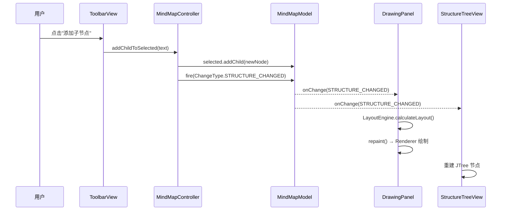

# 🧠 MindMap Desktop Application

一款基于 Java **Swing** 开发的轻量级思维导图桌面应用程序。项目采用 **MVC + 策略模式 + 观察者模式** 架构，布局算法可插拔，代码规模约 **1500 行**，适合作为 Java 桌面应用与经典设计模式的学习样本。

> 本仓库经过一轮架构翻新（P0/P1）：拆分了 Controller 层、细化了变更事件类型、将布局算法抽象为可注册的策略引擎。下文所述结构均以**当前代码**为准。

---

## 1. 快速开始

### 环境要求
- **JDK 23**（见 [`pom.xml`](./pom.xml)）
- **Maven 3.6+**
- 无第三方依赖，纯 JDK Swing

### 构建与运行
```bash
mvn compile
mvn exec:java -Dexec.mainClass="mindmap.app.MindMapApp"
```
或在 IDE 中直接运行 `mindmap.app.MindMapApp#main`。

---

## 2. 架构概览

经典 **MVC** 分层，各层通过接口 + 事件单向通信：

```
┌───────────────────────────────────────────────────────────────┐
│                           View (ui/)                          │
│    MainFrame │ ToolbarView │ StructureTreeView │ DrawingPanel │
│                                │                              │
│                         (用户操作)                             │
│                                ▼                              │
│                     Controller (controller/)                  │
│                      MindMapController                        │
│                                │                              │
│                         (修改数据)                             │
│                                ▼                              │
│                        Model (model/)                         │
│                   MindMapModel / MindNode                     │
│                                │                              │
│        (广播 ChangeType: STRUCTURE/SELECTION/LAYOUT/FILE)     │
│                                ▼                              │
│        所有 View 根据事件类型各自决定重算布局或仅重绘            │
└───────────────────────────────────────────────────────────────┘

                DrawingPanel 在绘制时调用：
                   ▼
             Engine (engine/)
      LayoutEngineFactory ─► LayoutEngine 实现类
                             ├─ AutoLayoutEngine
                             └─ DirectionalLayoutEngine
```

### 分层原则
| 层 | 可依赖 | 禁止依赖 |
|---|---|---|
| `model`   | 无（纯 POJO + 事件）       | Swing、AWT、Controller、View |
| `engine`  | `model`、`java.awt.FontMetrics` | Swing 组件、View、Controller |
| `controller` | `model`                   | View |
| `ui`      | `model`、`controller`、`engine` | —— |
| `util`    | `model`                    | View、Controller |

> 💡 这一套依赖方向保证了 **Model 和 Engine 可单独单元测试**，无需拉起 Swing。

---

## 3. 模块与代码清单

```
src/main/java/mindmap/
├── app/
│   └── MindMapApp.java            # 入口：EDT + LookAndFeel + 装配
├── model/                          # 数据层（无 Swing 依赖）
│   ├── MindNode.java              # 树节点（id, text, children, parent）
│   ├── MindMapModel.java          # 模型 + 事件源
│   ├── ChangeListener.java        # 变更监听接口
│   └── ChangeType.java            # 变更事件类型枚举
├── controller/
│   └── MindMapController.java     # 用户操作 → 模型变更的唯一入口
├── engine/                         # 布局算法（纯计算，无 Swing 组件依赖）
│   ├── LayoutEngine.java          # 策略接口（P1 新引入，推荐使用）
│   ├── LayoutManager.java         # @Deprecated 兼容桥接，勿再使用
│   ├── AutoLayoutEngine.java      # 通用自动布局（后序 + 前序递归）
│   ├── DirectionalLayoutEngine.java # 左/右流向布局
│   ├── LayoutEngineFactory.java   # 按名称注册/获取布局引擎
│   ├── LayoutResult.java          # 一次布局的全部坐标/尺寸结果
│   └── NodeLayout.java            # 单节点的坐标与尺寸
├── ui/
│   ├── MainFrame.java             # 主窗口装配（工具栏 + 树 + 画布）
│   ├── ToolbarView.java           # 顶部操作栏
│   ├── StructureTreeView.java     # 左侧结构树（JTree）
│   ├── DrawingPanel.java          # 画布：缩放/平移/拖动/选中
│   └── MindMapRenderer.java       # 纯绘制（Graphics2D，无状态）
└── util/
    └── FileHandler.java           # 文件保存 / 读取
```

**合计约 19 个文件、1500 行左右**，推荐一天内读完。

---

## 4. 核心设计点

### 4.1 事件类型细化（P0）

`ChangeType` 将"模型变更"拆分为四类，View 可以按需响应：

| 事件类型 | 含义 | 典型响应 |
|---|---|---|
| `STRUCTURE_CHANGED` | 节点增删、改名、换根 | 重算布局 + 刷新树 + 重绘 |
| `SELECTION_CHANGED` | 仅选中节点变化 | 仅重绘（不需重算布局） |
| `LAYOUT_CHANGED`    | 布局策略切换 | 重算布局 + 重绘 |
| `FILE_CHANGED`      | 当前文件名变化 | 仅刷新状态栏 |

> 旧版本只有单一"已变更"信号，无差别全量刷新。细化后避免了选中节点时还去跑整棵树的递归布局，也避免了换文件名时触发多余重绘。

### 4.2 布局算法插件化（P1）

```java
public interface LayoutEngine {
    LayoutResult calculateLayout(MindNode root, FontMetrics fm, String layoutType);
}
```

- `AutoLayoutEngine`：默认实现，采用 **后序 + 前序递归** 算法
  1. **后序**：自底向上累计每棵子树的高度（包围盒思想）
  2. **前序**：自顶向下按子树高度比例分配 Y 坐标，保证父子居中对齐
- `DirectionalLayoutEngine`：继承上面的算法，额外约束方向（`Right-Flow` / `Left-Flow`）
- `LayoutEngineFactory`：**注册表模式**，通过布局名字符串查表取引擎；**新增布局只需新增一个引擎类并在工厂注册一行，View 完全无感知**

> 旧的 `LayoutManager` 与 `java.awt.LayoutManager` 命名冲突，已改名为 `LayoutEngine`；原接口保留为空的 `@Deprecated` 子接口，作平滑过渡。

### 4.3 用户操作统一走 Controller（P0）

View 层（Toolbar / 树 / 画布）**禁止直接改模型**，所有写操作必须经过 `MindMapController`：

```
ToolbarView ─┐
TreeView    ─┼─► MindMapController ─► MindMapModel ─► ChangeEvent ─► 所有 View
DrawingPanel ┘
```

好处：
1. 业务逻辑（如"添加子节点后自动选中新节点"）集中一处维护
2. 未来加入 **撤销/重做（命令模式）** 时，只需在 Controller 层包装命令对象

### 4.4 绘制与交互职责分离

| 类 | 职责 | 是否有状态 |
|---|---|---|
| `DrawingPanel`    | 持有 `transform`（缩放/平移）、处理鼠标事件、调用 Renderer | 有 |
| `MindMapRenderer` | 输入 `LayoutResult` + `Graphics2D`，输出像素 | **无**（纯函数） |

> Renderer 无状态 → 可随时替换为导出 SVG / PNG 的 Renderer，复用布局结果。

---

## 5. 典型数据流：以"添加子节点"为例



---

## 6. 设计模式清单

| 模式 | 体现位置 |
|---|---|
| **组合 (Composite)** | `MindNode` 既是节点也是容器 |
| **策略 (Strategy)**  | `LayoutEngine` + 多种实现 |
| **简单工厂 / 注册表** | `LayoutEngineFactory` |
| **观察者 (Observer)** | `MindMapModel` ←→ `ChangeListener` |
| **MVC**               | model / controller / ui 三层分离 |

---

## 7. 从 0 开始的学习路径

建议按"数据→算法→控制→界面"自底向上阅读（约 2～3 小时通读）：

1. **Model 层**（30 min）
   `MindNode` → `ChangeType` → `ChangeListener` → `MindMapModel`
2. **Engine 层**（45 min）
   `NodeLayout` → `LayoutResult` → `LayoutEngine` → `AutoLayoutEngine` → `DirectionalLayoutEngine` → `LayoutEngineFactory`
3. **Controller 层**（20 min）
   `MindMapController`
4. **UI 层**（1 h）
   `MainFrame` → `ToolbarView` → `StructureTreeView` → `MindMapRenderer` → `DrawingPanel`
5. **Util**（10 min，可选）
   `FileHandler`

### 通关自检清单
- [ ] 添加节点时，`STRUCTURE_CHANGED` 会通知哪些 View？
- [ ] `STRUCTURE_CHANGED` 与 `LAYOUT_CHANGED` 分别触发什么响应？
- [ ] `SELECTION_CHANGED` 为什么不需要重算布局？
- [ ] 想新增一种"圆形布局"，需要动几个文件？（答：新建一个 Engine + Factory 注册 1 行）
- [ ] 为什么 `MindMapRenderer` 不持有 `MindNode` 引用？

---

## 8. 未来演进 Roadmap

- [ ] **撤销/重做**：在 Controller 层引入命令模式 + 操作栈
- [ ] **主题系统**：享元模式统一管理 `Color` / `Font`，一键切换深色模式
- [ ] **实时搜索**：DFS 遍历 + 高亮滚动定位
- [ ] **文件格式**：从 `ObjectOutputStream` 迁移到 JSON，便于跨版本兼容
- [ ] **异步布局**：超大树启用 `SwingWorker`，后台计算 `LayoutResult`，主线程仅 `repaint()`

---

## 9. License

本项目仅用于学习与交流。
